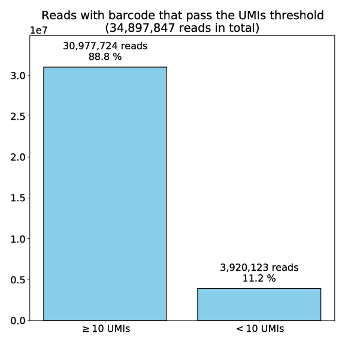
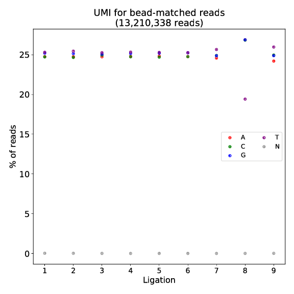
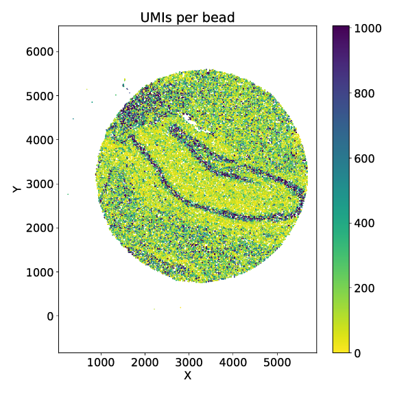

# Pipeline output

The pipeline outputs are in the `results` directory.
For example, here we have two samples (`sample1` and `sample2`):

```
$ ls results 
qc_metrics.csv  sample1  sample1.csv  sample1.pdf  sample2  sample2.csv  sample2.pdf  temp_files
```

The `temp_files` directory contains intermediate files and raw QC metrics.
So, it can be deleted.

You are interested in the following files:

 * `sample1.pdf`: the QC plots
 * `sample1`: the digital expression matrix
 * `sample1.csv`: the beads coordinates
 * `qc_metrics.csv`: QC metrics for all the samples (see details [here](#qc-metrics))

## Digital matrix expression and bead coordinates


The `sample1.csv` file contains the barcodes coordinates and the `sample1` directory contains the count matrix files.

```
$ tree results/sample1.csv results/sample1
results/sample1.csv [error opening dir]
results/sample1
├── barcodes.tsv.gz
├── features.tsv.gz
└── matrix.mtx.gz
```

We can import the count matrix and the coordinates in R this way for example:

```
library(Seurat)
library(dplyr)
library(readr)
library(tibble)

# digital expression matrix
counts <- Seurat::Read10X("results/sample1")

# spatial information
spatial <-
	readr::read_csv("results/sample1.csv") %>%
	dplyr::filter( Barcode %in% colnames(counts) ) %>%
	dplyr::arrange(Barcode) %>%
	tibble::column_to_rownames("Barcode")

stopifnot( sum( ! spatial$Barcode == colnames(counts) ) == 0 )

args <- list("project"="sample1", "assay"="Spatial", "meta.data"=spatial)
obj <- do.call(SeuratObject::CreateSeuratObject, c(counts, args))
```

If you use python:

```
import panda as pd
import scanpy as sc

spatial = pd.read_csv("results/sample1.csv").set_index("Barcode")

adata = sc.read_10x_mtx("results/sample1")
adata.obs = spatial.loc[ adata.obs.index ]
```

## QC metrics

 1. [First step: checking for barcode length (page 1)](#first-step-checking-for-barcode-length-page-1)
 2. [Second step: remove PCR duplicates (page 2)](#remove-pcr-duplicates-page-2)
 3. [Third step: mapping read 2 on the genome (page 3)](#third-step-mapping-read-2-on-the-genome-page-3)
 4. [Fourth step: filtering the barcodes with too few UMIs (page 4)](#fourth-step-filtering-the-barcodes-with-too-few-umis-page-4)
 5. [Fifth step: barcode matching (pages 5, 13, 14, and 15)](#fifth-step-barcode-matching-pages-5-13-14-and-15)
 6. [Sixth step: gene annotation of reads 2 (page 6)](#sixth-step-gene-annotation-of-reads-2-page-6)
 7. [Seventh step: remove-position-duplicates (page 7)](#seventh-step-remove-position-duplicates-page-7)
 8. [Eighth step: deduplication (page 8)](#eighth-step-deduplication-page-8)
 8. [Checking the read structure specification (pages 9 and 10)](#checking-the-read-structure-specification-pages-9-and-10)
 9. [Library complexity (pages 11, 12, 13 and 17)](#library-complexity-pages-11-12-13-and-17)
 10. [Looking for histological structures (page 18)](#looking-for-histological-structures-page-18)

### First step: checking for barcode length (page 1)

The first step is to throw away the read pairs whose read 1 is too short.
For example, if you have the following read structure `8C18U6C9M1X`, then you need at least 42 bp (or 41 bp if you remove the last base) in order to extract the UP primer and the UMI.
On the following picture, there are 68,647,673 reads in total and all of them are longer than 42 bp, so we keep all of them.


### Second step: remove PCR duplicates (page 2)

The second step is to extract bead barcode, UMI and UP primer sequence from read 1.
Then, we remove the duplicates that have same bead barcode, same UMI and same read 2 sequence.
We named these duplicates PCR duplicates, but maybe it is not *stricto sensu* the proper definition.
Anyway.
On the following picture, there are 11,460,743 reads that are considered as duplicates (among the 68,647,673 read pairs that are long enough).


### Third step: mapping read 2 on the genome (page 3)

We need match the UP primer sequence on read 1.
You can allow a certain tolerance in the matching by setting the maximum Hamming distance (usually 3 or 4).
On the following picture, there 52,055,737 (11,021,881+34,897,847) reads that match the UP primer (among the 68,647,673 read pairs that are long enough).

Then, we map read 2 on the genome and there are 34,897,847 reads that map the genome and have an acceptable UP primer sequence.


### Fourth step: filtering the barcodes with too few UMIs (page 4)

One might not be interested in bead with too few genes.
So, we can remove the beads with less than a given number of UMIs.
Here, we kept everything for example.



### Fifth step: barcode matching (pages 5, 14, 15, and 16)

The fifth step is to match the sequencing barcodes with the puck barcodes (among the reads pairs that match the UP primer and can be mapped on the genome).

Here (page 14) we can see that the sequencing data contained 93,357 bead barcodes and the puck contained 77,938 bead barcodes.
Among all the sequencing barcodes, we were able to associate 53,041 of them to a puck barcode.


On the following picture (page 5), we can see that among the 30,977,724 reads pairs that are UP-matched, genome-mapped and have more than 10 UMIs, there are 25,315,397 reads whose the barcode could be associated with a puck barcode.


During the barcode matching, we allow mismatches by using the Hamming distance.
The following histogram shows the location of these mismatches in the barcode sequence.
This can highlight mistakes in the read structure specification, or reveal unsucessful ligations during the base call.


A successful barcode matching can be revealed by comparing it with its counterpart performed with shuffled sequences.
This histogram shows, for each sequencing barcode, the smallest Hamming distance found among the puck barcodes.
In red is the case where we shuffled the puck barcodes sequences, and in blue is where we left the sequences unchaged.


### Sixth step: gene annotation of reads 2 (page 6)

We mapped reads 2 on the genome, now we need to annotate them.
We use [HTSeq](https://htseq.readthedocs.io/en/master/).
HTSeq can be successful or not in annotating a given mapping with a gene.
Here, we plot the reads for which HTSeq was successful.


### Seventh step: remove position duplicates (page 7)

We remove the duplicated reads that have same bead barcode and UMI and same mapping position on the genome.
We called these duplicates position duplicates even if we are not sure they should be name as such (tagmentation duplicates?).
These duplicates are removed because they map the same gene.

We can see that among the 16,064,290 reads that map an annotated gene, there are 14,596,571 reads than we can use to generate a digital expression matrix.


### Eighth step: deduplication (page 8)

The deduplication step is to pick one read when a (barcode,UMI) pair is associated with multiple reads.
In our case we want to have unique (barcode,UMI,gene) tuples in order to produce the count matrix.

The `unique` column is when there is a unique (barcode,UMI,gene) tuple.
In this case, we don't need to do anything and we can just pick this tuple.

The `Included` and `Excluded` correspond to the case where there are multiple (barcode,UMI,gene) tuples, but one of these tuples has more mappings than the others.
For example:

 * (`ACGTACTTCATGCA`,`TGCAACGT`,GeneA,14)
 * (`ACGTACTTCATGCA`,`TGCAACGT`,GeneB,12)
 * (`ACGTACTTCATGCA`,`TGCAACGT`,GeneB,61)
 * (`ACGTACTTCATGCA`,`TGCAACGT`,GeneC,21)

Here, the third tuple has `61` mappings at different positions for `GeneB`, while the others have `21` mappings at the most.
In this situation, we choose the majority vote and include the third (`Included`) while excluding the others (`Excluded`).
We also make the distinction between the second one (`Excluded Same gene`) and the first and the fourth `Excluded Different gene`).

The `Unresolved` column is the case where there are multiple (barcode,UMI,gene) tuples, but none of them stands out.
For example:

 * (`ACGTACTTCATGCA`,`TGCAACGT`,GeneA,60)
 * (`ACGTACTTCATGCA`,`TGCAACGT`,GeneB,60)
 * (`ACGTACTTCATGCA`,`TGCAACGT`,GeneC,60)

In this situation we throw everything.


### Checking the read structure specification (pages 9 and 10)

Barcodes and UMIs are generated randomly.
So, we should get ~25 % of all bases at each position.
Therefore, we plot the bases frequencies in order to spot possible mistakes in the read structure specification.


For the barcodes:


For the UMIs:



### Library complexity (pages 11, 12, 13 and 17)

There are numerous ways to assess library complexity.
Here are some metrics that we use.

The saturation of the total reads by the TOP 10 % barcodes with the highest number of UMIs (page 10).
<span style="color:green">This plot is probably poorly made in the pipeline. It needs to be recoded.</span>


The average number of UMIs per barcode for all the barcodes and for the TOP 10 % barcodes with the highest number of UMIs (page 17).


Histogram of the number of UMIs per barcode (page 12).


Histogram of the number of genes per barcode (page 13).


### Looking for histological structures (page 18)

The best way to see if the pipeline was successul is to plot the number of UMIs per bead on the XY plane and search for known histological structures.



