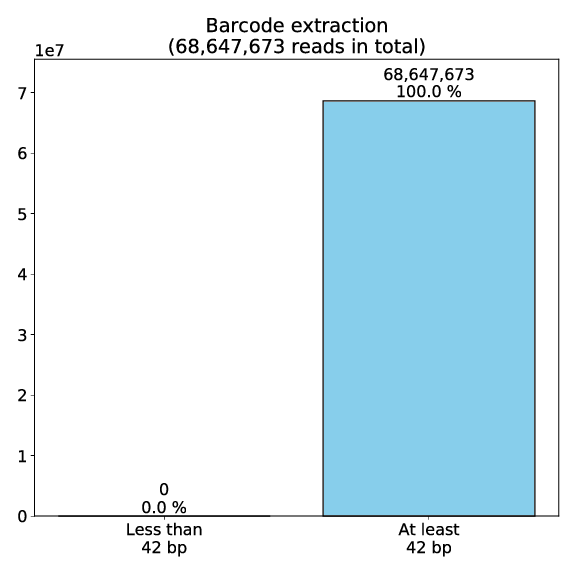
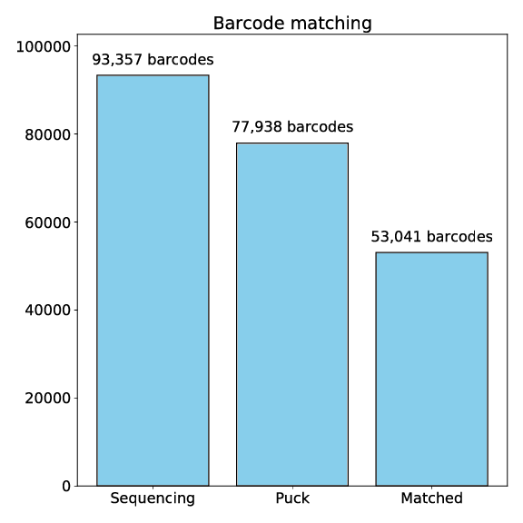
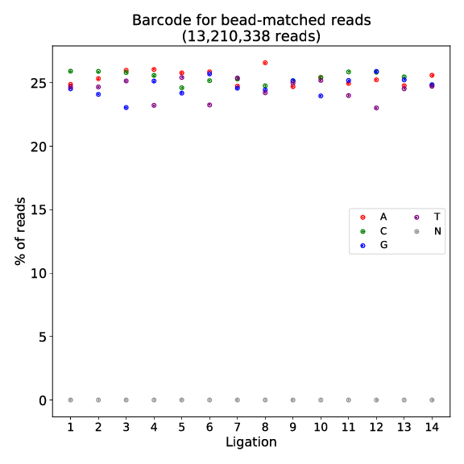
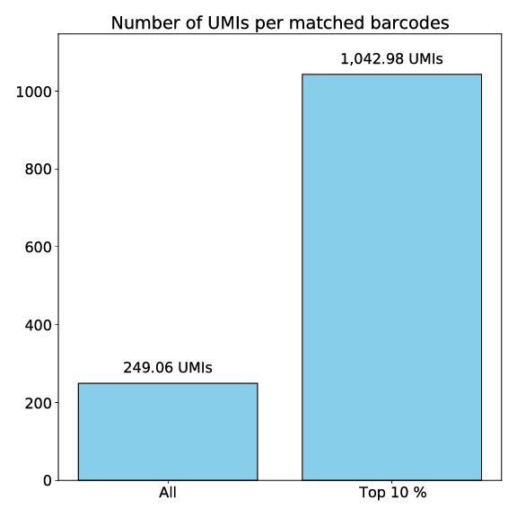

# Output

The pipeline outputs are in the `results` directory.
For example, here we have two samples (`sample1` and `sample2`):

```
$ ls results 
files  qc  sample1.csv  sample1_dge  sample1.pdf  sample2.csv  sample2_dge  sample2.pdf
```

The `files` and `qc` directories contain intermediate files and raw QC metrics respectively.
So, they can be both deleted.

You are interested in the following files:

 * `sample1.pdf`: the QC plots
 * `sample1_dge`: the digital expression matrix
 * `sample1.csv`: the beads coordinates

## Digital matrix expression and bead coordinates

```
$ tree results/sample1.csv results/sample1_dge
results/sample1.csv [error opening dir]
results/sample1_dge
├── barcodes.tsv.gz
├── features.tsv.gz
└── matrix.mtx.gz
```

## QC metrics

### First step: checking for barcode length (page 1)

The first step is to throw away the read pairs whose read 1 is too short.
For example, if you have the following read structure `8C18U6C9M1X`, then you need at least 42 bp (or 41 bp if you remove the last base) in order to extract the UP primer and the UMI.
On the following picture, there are 68,647,673 reads in total and all of them are longer than 42 bp, so we keep all of them.



### Second step: matching UP primer (page 2)

The second step is to match the UP primer sequence on read 1 (among those that are long enough).
You can allow a certain tolerance in the matching by setting the maximum hamming distance (usually 3 or 4).
On the following picture, there 52,055,737 reads that match the UP primer (among the 68,647,673 read pairs that are long enough).


### Third step: mapping read 2 on the genome (page 3)

The third step is to map read 2 on the genome.
For example, here we can see that among the 52,055,737 reads pairs that match the UP primer 40,420,278 of them can be mapped on the genome.


### Fourth step: filtering the barcodes with too few UMIs (page 4)

One might not be interested in bead with too few genes.
So, we can remove the beads with less than a given number of UMIs.
Here, we kept everything for example.


### Fifth step: barcode matching (page 5, 13, 14, and 15)










